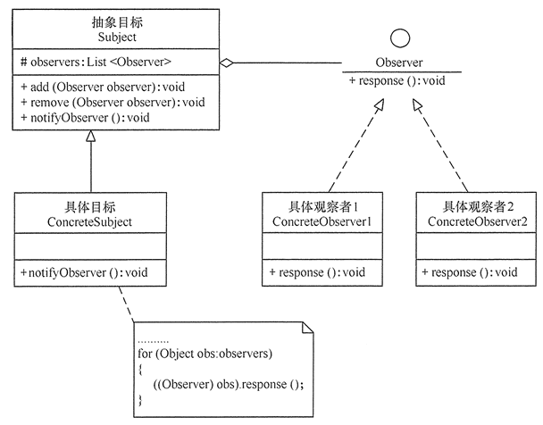
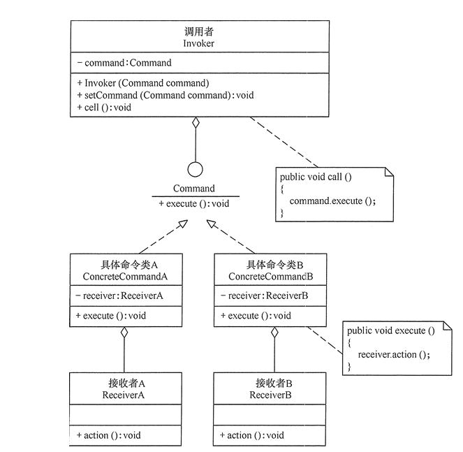
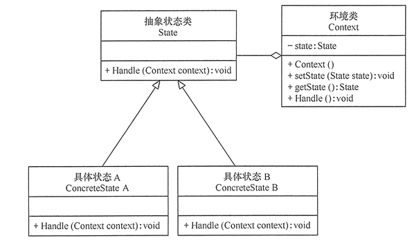

# JAVA 23种设计模式
## 一、创建模式
### 1.单例模式
##### 定义: 确保一个类最多只有一个实例，并提供一个全局访问点。分为预加载和懒加载两种模式。

### 2.工厂模式
#### 2.1 简单工厂模式
#### 定义： 定义了一个创建对象的类，由这个类来封装实例化对象的行为。
#### 优点：
#### 缺点：
#### 2.2 工厂方法模式
#### 定义： 定义了一个创建对象的抽象方法，由子类决定要实例化的类。工厂方法模式将对象的实例化推迟到子类。
#### 优点：
#### 缺点：
### 3.抽象工厂模式
#### 定义： 定义了一个接口用于创建相关或有依赖关系的对象族，而无需明确指定具体类。
#### 优点：
#### 缺点：
### 4.建造者模式
#### 定义： Separate the construction of a complex object from its representation so that the same construction process can create different representations.（将一个复杂对象的构建与它的表示分离，使得同样的构建过程可以创建不同的表示。。
#### 模型结构
建造者（Builder）模式的主要角色如下。
- 产品角色（Product）：它是包含多个组成部件的复杂对象，由具体建造者来创建其各个滅部件。
- 抽象建造者（Builder）：它是一个包含创建产品各个子部件的抽象方法的接口，通常还包含一个返回复杂产品的方法 getResult()。
- 具体建造者(Concrete Builder）：实现 Builder 接口，完成复杂产品的各个部件的具体创建方法。
- 指挥者（Director）：它调用建造者对象中的部件构造与装配方法完成复杂对象的创建，在指挥者中不涉及具体产品的信息。

详细的UML结构图如下：

#### 使用场景：
- 相同的方法，不同的执行顺序，产生不同的事件结果时，可以采用建造者模式。
- 多个部件或零件，都可以装配到一个对象中，但是产生的运行结果又不相同时，则可以使用该模式。
- 产品类非常复杂，或者产品类中的调用顺序不同产生了不同的效能，这个时候使用建造者模式非常合适。
### 5.原型模式
#### 定义：
#### 优点：
#### 缺点：

## 二、行为模式
### 1.策略模式
#### 定义：
#### 优点：
#### 缺点：
### 2.模板方法模式
#### 定义：
#### 优点：
#### 缺点：
### 3.观察者模式
#### 定义：指多个对象间存在一对多的依赖关系，当某个对象的状态发生变化时，所有依赖它的对象都需要得到通知并且被自动更新。也叫发布-订阅模式，模型-视图模式。
#### 模型结构

#### 优点：
- 降低目标与观察者之间的耦合关系，两者抽象耦合关系。
- 建立了一套“通知-自动更新”的触发机制。
#### 缺点：
- 目标与观察者没有完全解除依赖关系，可能会出现循环依赖。
- 当观察者数量较多时，会影响程序执行效率。
### 4.迭代子模式
#### 定义：
#### 优点：
#### 缺点：
### 5.责任链模式
#### 定义：
#### 优点：
#### 缺点：
### 6.命令模式
#### 定义：将请求封装成对象，以使用不同的请求、队列或者日志来参数化其他对象，命令模式也支持可撤销的操作。
#### 模型结构

#### 优点：
  - 降低系统的耦合度：命令模式能将调用操作的对象与实现该操作的对象解耦。
  - 增加或删除命令非常方便：采用命令模式增加与删除命令不会影响其他类，它满足“开闭原则”，对扩展比较灵活。
  - 可以实现宏命令：命令模式可以与组合模式结合，将多个命令装配成一个组合命令，即宏命令。
  - 方便实现Undo和Redo操作。命令模式可以与后面介绍的备忘录模式结合，实现命令的撤销与恢复。
#### 缺点：
  产生大量具体的命令类
### 7.备忘录模式
#### 定义：
#### 优点：
#### 缺点：
### 8.状态模式
#### 定义

对有状态的对象，把复杂的判断逻辑提取到不同的状态对象，允许状态对象在其内部状态发生变化时改变其行为。

#### 模型结构
状态模式包含以下主要角色:
- 环境（Context）角色：也称为上下文，它定义了客户感兴趣的接口，维护一个当前状态，并将与状态相关的操作委托给当前状态对象来处理。
- 抽象状态（State）角色：定义一个接口，用以封装环境对象中的特定状态所对应的行为。
- 具体状态（Concrete    State）角色：实现抽象状态所对应的行为。

UML结构图如下:

#### 优点
- 状态模式将与特定状态相关的行为局部化到一个状态中，并且将不同状态的行为分割开来，满足“单一职责原则”。
- 减少对象间的相互依赖。将不同的状态引入独立的对象中会使得状态转换变得更加明确，且减少对象间的相互依赖。
- 有利于程序的扩展。通过定义新的子类很容易地增加新的状态和转换。
#### 缺点：
- 状态模式的使用必然会增加系统的类与对象的个数。
- 状态模式的结构与实现都较为复杂，如果使用不当会导致程序结构和代码的混乱。
### 9.访问者模式
#### 定义：
#### 优点：
#### 缺点：
### 10.中介者模式
#### 定义：
#### 优点：
#### 缺点：
### 11.解释器模式
#### 定义：
#### 优点：
#### 缺点：

## 三、结构模式
### 1.适配器模式
#### 定义
#### 优点：
#### 缺点：
### 2.装饰器模式
#### 定义：
#### 优点：
#### 缺点：
### 3.代理模式
#### 定义：
#### 优点：
#### 缺点：
### 4.外观模式
#### 定义：
#### 优点：
#### 缺点：
### 5.桥接模式
#### 定义：
#### 优点：
#### 缺点：
### 6.组合模式
#### 定义：
#### 优点：
#### 缺点：
### 7.享元模式
#### 定义：
#### 优点：
#### 缺点：